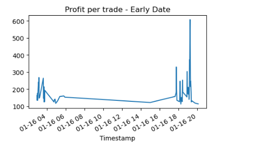
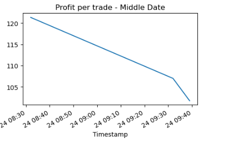
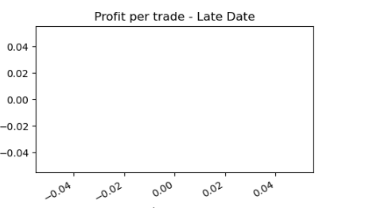

# Challenge 3 Crypto Arbitrage
This challenge considers arbitrage opportunities in Bitcoin and other cryptocurrencies. It does so from data from two exchanges: Bitstamp and Coinbase.

# Finding & Analysis

After collecting, preparing, and analyzing the data, here is what we found:

The profitbale trades were much higher early in the first month of the year then it decreased in the second month and disappeared on the third month.
